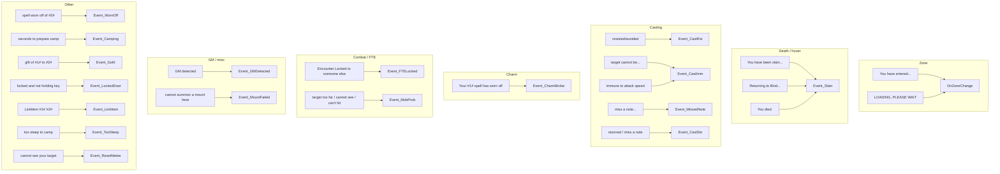

# Events (MQ events and zone)

The bot subscribes to MQ (game) events in `botevents.BindEvents()`. Handlers run when `mq.doevents()` is called from the **doEvents** hook. This page charts which events exist and how they update state or runconfig.

## Event → handler overview

Additional events are registered by **chchain** and **follow** in their own `registerEvents()` (e.g. CHChain Go, stop, start, tank, pause).

---

## OnZoneChange (and DelayOnZone)

Used by the **zoneCheck** hook (when `zonename != Zone.ShortName()`) and by MQ zone events ("You have entered", "LOADING, PLEASE WAIT").

1. Sets `statusMessage = 'Zone change, waiting...'`, delay 1s.
2. **DelayOnZone()**:
    - Calls **ResetCombatSession('zone')** (clear run state, engage target, MobList, stick/attack/target, debuff tracking).
    - Sets `zonename` to current zone short name.
    - Clears camp: `makecamp` and `campstatus = false`.
    - Turns off `dopull` via `botpull.DisablePull('zone')`.
    - Runs mobfilter for exclude and priority (zone).
    - Resets `MountCastFailed`.
3. Clears `statusMessage`.

See [Run state machine](run-state-machine.md) and [hook AddSpawnCheck](hook-addspawncheck.md) (MobList is rebuilt each tick from current zone/camp).

---

## Event_Slain

Runs when the character is slain or "Returning to Bind Location" or "You died." (hover).

- Calls **ResetCombatSession('death')** immediately (engage target, MobList, stick/attack/target cleared).
- Prints remaining hover time; runs `/consent group`, `/consent raid`, `/consent guild`.
- Sets `HoverTimer = mq.gettime() + 30000` so CharState can throttle calling Event_Slain again.

On first enter dead/hover, **charState** also calls `ResetCombatSession('death')`, `botpull.DisablePull('death')`, `follow.StopFollow('death')`, and `botmove.ClearCamp('death')` once (via `wasDeadOrHover` transition). Pull stays off until manually re-enabled. On rez (same zone), **charState** calls `ResetCombatSession('rez')` so target/camp/engage state matches a zone-style reset.

CharState sets `runState = 'dead'` when `Me.Dead()` or `Me.Hovering()` and sets `HoverEchoTimer`; when `HoverTimer` has passed it calls `Event_Slain()`.

---

## Event_FTELocked

Target is Encounter Locked (FTE) to someone else.

- Resolves **NPC spawn id** only (ignores PC/self target; falls back to `engageTargetId` or `pullAPTargetID` when the chat event fires while targeted on yourself).
- Echoes message; increments `FTECount` if it was 0.
- Records `FTEList[spawnId]` via `spawnutils.recordFTE`: short **combat** block (2s + escalation), **in-camp recheck** every 2s, and **pull unpullable** for `pull.fteLockoutSec` (default 120s) when `dopull` is on.
- Clears `engageTargetId` when it matches the FTE spawn.
- Runs: `/mqtarget myself`, `/attack off`, `/stopcast`, `/nav stop`, `/stick off`.
- If `dopull` is true: `botpull.AbortPullForFTE` (return to camp when mid-pull).

**Camp list** (`AddSpawnCheck` / `buildCampMobList`) excludes spawns while `combatBlockedUntil` is active; `tickCombatFTERechecks` re-targets in-camp entries every 2s and clears the combat block when no new FTE message arrives.

**Pull list** uses `pullUnpullableUntil` only (`pull.fteLockoutSec`, default 120s), not the combat block — so a false in-camp FTE does not block pull selection for the full combat window.

**Roam / hunter pull:** When `pull.roam` or `pull.hunter` is active with `dopull`, FTE records only the pull-unpullable window (no `nextCombatRecheckAt`). The bot aborts the current hunt/pull without return nav and selects the next target; it does not run the 2s in-camp FTE recheck loop for those mobs.

Manual reset: `/cz fte clear` (current NPC target) or `/cz fte clear all`.

---

## Event_GMDetected

Called when GM check (e.g. MQ2GMCheck) indicates a GM is present. Throttled by `gmtimer` (60s).

- Disables domelee; `/stick off`; clears `makecamp` and `CampStatus`; sets `gmtimer` so the handler won’t fire again for 60s.

---

## Event_CastRst / Event_CastImm

These handlers feed cast outcomes into `lib/casting.lua` for all cast backends. Resist/immune signals are normalized there and consumed by `handleSpellCheckReentry` (see [Spell casting flow](spell-casting-flow.md)).

- **CastRst** (resist/avoid): sets normalized cast result to `CAST_RESIST` (and still sets `SpellResisted` for legacy non-library paths).
- **CastImm** (target cannot be / immune to slow): sets normalized cast result to `CAST_IMMUNE`; immune list updates are applied during cast completion.

---

## Other handlers (short notes)

| Event       | Handler           | Effect                                                                                       |
| ----------- | ----------------- | -------------------------------------------------------------------------------------------- |
| MissedNote  | Event_MissedNote  | Sets `runconfig.MissedNote = true`                                                           |
| CastStn     | Event_CastStn     | Stub (no-op)                                                                                 |
| CharmBroke  | Event_CharmBroke  | `charm.OnCharmBroke(line, charmspell)`                                                       |
| ResetMelee  | Event_ResetMelee  | Stub                                                                                         |
| WornOff     | Event_WornOff     | Stub                                                                                         |
| Camping     | Event_Camping     | Stub                                                                                         |
| GoM         | Event_GoM         | Stub                                                                                         |
| LockedDoor  | Event_LockedDoor  | Stub                                                                                         |
| LinkItem    | Event_LinkItem    | Validates slot/HP filter; echoes item link and /rs                                           |
| TooSteep    | Event_TooSteep    | Stub                                                                                         |
| MountFailed | Event_MountFailed | If domount: sets global `MountCastFailed = true`                                             |
| MobProb     | Event_MobProb     | Throttled 3s; if engageTargetId and path length ≤ acleash, /nav to target; sets mobprobtimer |

---

## Reference

- All event registrations: `botevents.lua` → `BindEvents()`.
- doEvents hook: [hook-doevents](hook-doevents.md).
- Zone detection: [hook-zonecheck](hook-zonecheck.md).
