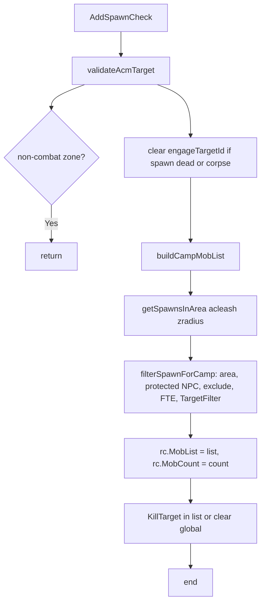

# Hook: AddSpawnCheck

**Priority:** 400  
**Provider:** lib.spawnutils

## Logic

- **validateAcmTarget:** If engageTargetId spawn missing or corpse, clear engageTargetId. If non-combat zone (configured in **cz_common** `noCombatZones`; see [Safety and stealth](../safety-and-stealth.md)), return false and hook exits.
- **buildCampMobList:** Uses camp center (makecamp if campstatus, else current position). getSpawnsInArea(rc, acleash, zradius); for each spawn, filterSpawnForCamp (in area, not soulbinder/translocator, not in ExcludeList, not FTE-locked, TargetFilter: 0 = NPC/pet aggressive LOS, 1 = NPC/pet LOS, 2 = not pc/banner/campfire etc.). Spawns with missing or empty `Type()` (stale TLO during despawn) are skipped silently. Sorted by ID; returns list and count.
- **KillTarget:** Global KillTarget is kept in sync: if set and that spawn is not in MobList (e.g. corpse or gone), clear global; if set and not in list, append that spawn to MobList unless the spawn is a protected NPC.
- **Bards (idle):** When MobList is empty, starts noncombat twist unless near primary bind point (bind stealth); see [Safety and stealth](../safety-and-stealth.md).

MobList and MobCount are used by doMelee, doPull, doHeal, doDebuff, and others. Filter logic: `lib/spawnutils.lua` (filterSpawnForCamp, filterSpawnExcludeAndFTE, filterSpawnTargetFilter).

## See also

- [README](README.md)
- [Safety and stealth](../safety-and-stealth.md) — no-combat zones, protected NPCs, bind stealth
- [hook-domelee](hook-domelee.md) — uses MobList, engageTargetId
- [hook-dopull](hook-dopull.md) — uses MobCount, buildPullMobList in spawnutils
