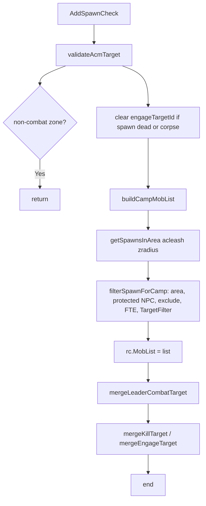

# Hook: AddSpawnCheck

**Priority:** 400  
**Provider:** lib.spawnutils

## Logic

- **validateAcmTarget:** If engageTargetId spawn missing or corpse, clear engageTargetId. If non-combat zone (configured in **cz_common** `noCombatZones`; see [Safety and stealth](../safety-and-stealth.md)), return false and hook exits.
- **buildCampMobList:** Uses **MobList anchor** from `getMobListAnchor` (see below). `getSpawnsInArea(rc, acleash, zradius)`; for each spawn, `filterSpawnForCamp` (in area, not soulbinder/translocator, not in ExcludeList, not FTE-locked, TargetFilter: 0 = NPC/pet aggressive LOS, 1 = NPC/pet LOS, 2 = not pc/banner/campfire etc.). Spawns with missing or empty `Type()` (stale TLO during despawn) are skipped silently. Sorted by ID.
- **mergeLeaderCombatTarget:** When `settings.maCampAnchor` is on, injects the MA's (or MT fallback) live NPC target into MobList when the leader is within `maAnchorLeash` of this bot and charinfo `State[]` contains `"ATTACK"`. Bypasses area distance, TargetFilter/LoS, and FTE combat block for that spawn. Still respects exclude list, protected NPCs, and roam unpullable.
- **KillTarget / engageTargetId:** Global KillTarget and `engageTargetId` are merged into MobList when valid.
- **Bards (idle):** When MobList is empty, starts noncombat twist unless near primary bind point (bind stealth); see [Safety and stealth](../safety-and-stealth.md).

## MobList anchor (`getMobListAnchor`)

Mob bubble scans (not pull radius) center on:

1. **MA position** — when `maCampAnchor` on, this bot is not the MA, MA is a charinfo peer (or Spawn fallback for human MA), alive, same zone (`Zone.Distance` not nil), and within `maAnchorLeash` (defaults to `acleash`). Position from `peer.Zone.X/Y/Z`.
2. **Camp pin** — when `campstatus` and makecamp coords set.
3. **Player** — fallback.

Pull scans still use `getPullAreaCenter` (camp/hunter/roam rules unchanged). Camp-return leash still uses the physical camp pin.

**Diagnostics:** `/cz mobfilter [spawnId]` prints anchor source, filter pass/fail per gate, and MA charinfo State/Target.

## See also

- [README](README.md)
- [Tank and assist roles](../tank-and-assist-roles.md) — MA anchor behavior
- [Safety and stealth](../safety-and-stealth.md) — no-combat zones, protected NPCs, bind stealth
- [hook-domelee](hook-domelee.md) — uses MobList, engageTargetId
- [hook-dopull](hook-dopull.md) — uses MobCount, buildPullMobList in spawnutils
