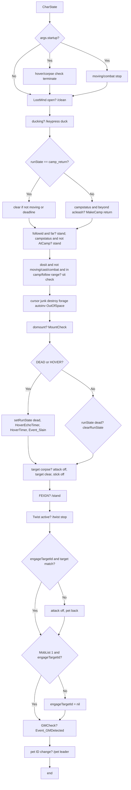

# Hook: charState

**Priority:** 300  
**Provider:** Built-in (botlogic.lua)  
**runWhenDead:** true

## Logic

CharState runs a long sequence of per-tick checks. Order of operations:

- **Startup:** On first run with arg `startup`: if hovering/corpse, set terminate; stop nav/stick; if combat, attack off.
- **Camp return:** If runState is camp_return and (not moving or deadline passed), clearRunState. If campstatus and beyond acleash, call botmove.MakeCamp('return').
- **Sit / stand with camp & follow:** When dosit is on, not moving, no cast, no combat, no autofire: if follow is active and beyond follow distance, or campstatus is true and `botmove.AtCamp()` is false, force `/stand` and skip sitting; otherwise, if mana/endurance are in the sit band (and not 40%% HP with mobs) then `/sit on` using the usual hysteresis around `sitmana`/`sitendur`. When mobs are in camp and the character is level 20+, sitting also requires `Me.PctAggro` below `sitaggro` (default 60).
- **Dead (checked first, before sit/forage/mount):** If `Me.Dead()` or `Me.Hovering()`, skip all other charState logic. On **enter** dead/hover: `ResetCombatSession('death')`, disable pull, stop follow, clear camp (once). While dead: set runState `dead`, set HoverEchoTimer if unset, call Event_Slain when HoverTimer expired. On **rez** (leave dead/hover): `ResetCombatSession('rez')`, reset hover timers, clear corpse target; then normal charState resumes. Pull stays off until manually re-enabled.
- **Engage:** If we have no engageTargetId or our target is not engageTargetId, attack off and pet back. If no MobList[1] and engageTargetId, clear engageTargetId.
- **Pet:** If pet ID changed (new pet or different), set MyPetID and /pet leader.
- **Cursor / inventory:** Zone junk on the cursor → `/destroy`. Full bags with something on the cursor → `OutOfSpace` and a message. **`/autoinv` only** when `runconfig.forageExpectCursor` is set (after `/doability Forage`); the flag clears when the cursor was seen and then emptied, or after a short stale deadline if forage yielded nothing. Manual cursor items are not auto-inventoried here. Before a cast starts, `spellutils.AutoinvIfCursorBlockingCast()` clears the cursor when needed (see spell casting flow).

## See also

- [README](README.md)
- [Run state machine](run-state-machine.md) — dead, camp_return
- [Events](events.md) — Event_Slain, Event_GMDetected
- [Movement and misc state](movement-and-misc.md) — MakeCamp return
