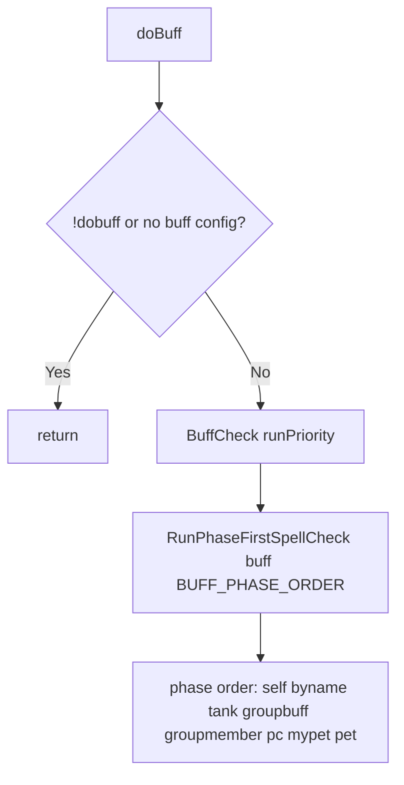

# Hook: doBuff

**Priority:** 1100  
**Provider:** botbuff

## Logic

Runs the phase-first spell check for the **buff** section. Phase order: self, byname, tank, groupbuff, groupmember, pc, mypet, pet.

**Guards:** doBuff is skipped when travel mode is on, when `dobuff` is off or there is no buff config, or when the bot is a **cleric** in a group and a **group member** has a PC corpse within **acleash**—so clerics focus on heal/rez for downed groupmates. Nearby corpses that are not group members (or any corpses when not grouped) do not defer buffing. **Buffs remain skipped during travel even when `/cz attack` is active** (only melee/heal/cure/debuff are temporarily enabled).

BuffCheck calls RunPhaseFirstSpellCheck with buff-specific getTargetsForPhase and targetNeedsSpell. Spell-level **entryValid** gating (before per-target checks) applies **inCombat** and **combatOnly** (non-bard) so some buffs run only when idle, only when mobs are in camp, or both; see [Buffing configuration](../buffing-configuration.md). Bands control which phases each spell uses via **targetphase** (self, tank, groupbuff, groupmember, pc, mypet, pet). Pet summon spells are auto-detected (Category Pet or SPA 33/103) and only cast when the bot has no pet. IconCheck and PeerHasBuff / Stacks / FreeBuffSlots determine if a target needs the spell. Spell completion and interrupt (including MQ2Cast) are described in [Spell casting flow](spell-casting-flow.md).

## See also

- [README](README.md)
- [Spell casting flow](spell-casting-flow.md)
- [Buffing configuration](../buffing-configuration.md)
- [Spell targeting and bands](../spell-targeting-and-bands.md)
