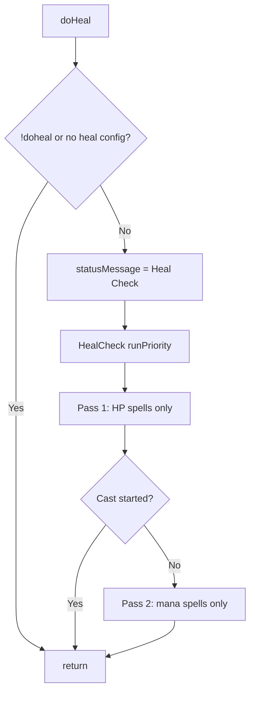

# Hook: doHeal

**Priority:** 900  
**Provider:** botheal

## Logic

Runs the phase-first spell check for the **heal** section in two resource passes. Phase order (within each pass): corpse, self, groupheal, tank, groupmember, pc, mypet, pet, xtgt.

HealCheck builds context (tank, bots, spell ranges, etc.) and calls `RunPhaseFirstSpellCheck` twice when needed:

1. **HP pass** — spells where `healResource` is `'hp'` (default), including corpse rez.
2. **Mana pass** — spells where `healResource` is `'mana'` (e.g. cannibalize); runs only if the HP pass did not start a cast.

Each pass uses heal-specific `getTargetsForPhase`, filtered `getSpellIndicesForPhase`, and `targetNeedsSpell` (HP bands, corpse rez filters, group/xt). Each phase returns targets (e.g. corpse IDs, self, tank, group members); spells that have that phase in their bands are tried in order; first valid (beforeCast, immuneCheck, PreCondCheck) triggers CastSpell. Resume after a cast continues the pass matching the stored spell's resource type. Spell completion and interrupt (including MQ2Cast) are described in [Spell casting flow](spell-casting-flow.md).

## See also

- [README](README.md)
- [Spell casting flow](spell-casting-flow.md)
- [Healing configuration](../healing-configuration.md)
- [Spell targeting and bands](../spell-targeting-and-bands.md)
