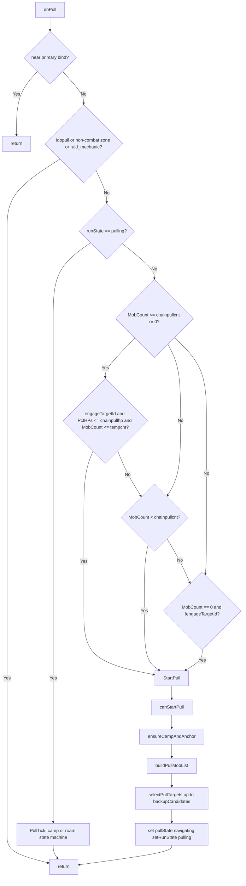

# Hook: doPull

**Priority:** 800  
**Provider:** botpull

## Logic

When runState is **pulling**, the hook runs PullTick (state machine). Otherwise it decides whether to start a new pull (chain pull conditions or idle with no engage).

While **dopull** is on, the hook also keeps MQ2Map **SpellRadius** (green ring) aligned with **pull.radius** and **CastRadius** with the effective pull range. Updates are throttled via last-applied state in `botpull.syncPullMapFilter`; enabling pull (`/cz dopull on` or the status-tab toggle) forces an immediate sync. When **dopull** is off, czbot does not adjust map radii.

- **Map radii:** Each doPull tick (when dopull is on) calls `syncPullMapFilter`; StartPull also calls it via ensureCampAndAnchor.
- **Non-combat zones** are configured in **cz_common** `noCombatZones` (GUI Mob lists tab). **Bind stealth** blocks pulling near primary bind. See [Safety and stealth](../safety-and-stealth.md).
- **StartPull:** Requires canStartPull (no MasterPause, HP > 45%, nav mesh, group checks); ensureCampAndAnchor (syncPullMapFilter, makecamp or mobile anchor); buildPullMobList (spawnutils); `selectPullTargets` (up to **pull.backupCandidates**, default 3 — closest by path, or priority list if usepriority). Stores `pullCandidateIds` / `pullCandidateIndex` for the outing. Then /attack off, /stick off, /mqtarget clear, /nav to first spawn; set pullAPTargetID, pullTagTimer, setRunState('pulling', { priority = doPull }). Camp: `pullState = navigating`, pullReturnTimer set. Roam (`pull.roam`): `pullState = roam_navigating`, no return timer. On soft target failure (FTE, EngageCheck, below 100% HP, no-aggro timeout), `advanceToNextPullCandidate` tries the next queued ID before camp return.
- **PullTick:** Camp: navigating → aggroing → returning → waiting_combat. Roam: roam_navigating → roam_aggroing → roam_fighting (fight in place, advance anchor on kill). When roam idle and no targets in pull.radius, nav stopped and bot waits. See [Movement and misc state](movement-and-misc.md#pull-state-machine-dopull) for camp pull details.

## See also

- [README](README.md)
- [Safety and stealth](../safety-and-stealth.md)
- [Run state machine](run-state-machine.md)
- [Movement and misc state](movement-and-misc.md) — pull state machine
- [Pull configuration](../pull-configuration.md)
