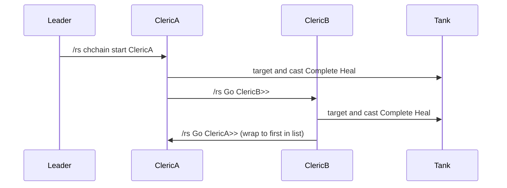

# CHChain Configuration

This document explains **CHChain** (Complete Heal chain): how to configure and run a coordinated Complete Heal rotation across multiple clerics on a shared tank target. It is intended for operators running bobblebot on each cleric in the chain.

## Overview

CHChain rotates **Complete Heal** casts across an ordered list of clerics. Each cleric takes a turn targeting the chain tank, casting Complete Heal, then passing the turn to the next cleric via raid say (`/rs`).

- **Runtime only:** CHChain is enabled with `/cz chchain` commands. It is **not** stored in `cz_<CharName>.lua` and does not persist across bot restarts.
- **Spell requirement:** Each cleric in the chain must have **Complete Heal** in their spell book.
- **Suppressed activity:** While CHChain is active, the bot forces off normal heal, buff, debuff, melee, cure, and pull activity. Previous settings are saved on setup and restored when you **stop** the chain.

---

## Prerequisites

- Each cleric in the chain runs bobblebot and has **Complete Heal** memorized or in their spell book.
- Cleric names in the setup list must match in-game character names (comparison is case-insensitive).
- All participating bots must hear coordination messages. Use **`/rs`** (raid say) to broadcast setup, start, tank, pause, and turn-pass messages to every client.

---

## Setup

Configure the chain on each cleric (or broadcast once so all bots configure themselves):

```text
/cz chchain setup <cleric1,cleric2,...> [pause] [tank1,tank2,...]
```

**Broadcast example:**

```text
/rs chchain setup HealerA,HealerB,HealerC 30 MainTank,OffTank
```

| Argument | Purpose |
|----------|---------|
| **cleric list** | Comma-separated rotation order. **Your toon must appear in this list** or setup fails on that client. |
| **pause** | Optional. Delay between turns, in **tenths of a second** (`30` = 3.0 s). |
| **tank list** | Optional. Comma-separated backup tanks. The first alive PC in zone becomes the CH target. If a tank dies or zones, the bot advances to the next name in the list. |

On successful setup, each participating cleric:

- Enables CHChain mode and records who receives the next turn after them.
- Disables **doheal**, **dobuff**, **dodebuff**, **domelee**, **docure**, and **dopull**.
- Announces via `/rs`: `CHChain ON (NextClr: ..., Pause: ..., Tank: ...)`.

---

## Starting the chain

Kick off the first cleric:

```text
/cz chchain start <FirstCleric>
```

Or broadcast:

```text
/rs chchain start HealerA
```

Only the named cleric executes their turn: target the chain tank and cast Complete Heal.

---

## Runtime control

| Command | Purpose |
|---------|---------|
| **/cz chchain stop** | Disable CHChain and restore settings saved before setup. Also works via `/rs chchain stop`. |
| **/cz chchain tank \<name\>** | Change the CH target. Broadcast with `/rs chchain tank <name>`. |
| **/cz chchain pause [val]** | Set pause (tenths of a second) or report the current value. Broadcast with `/rs chchain pause <val>`. |

**Typical session:**

```text
/rs chchain setup HealerA,HealerB,HealerC 30 MainTank
/rs chchain start HealerA
```

When finished:

```text
/rs chchain stop
```

---

## How rotation works

Each cleric knows **chnextClr** — the next name after themselves in the setup list, wrapping back to the first cleric at the end.



1. A **`Go <ClericName>>`** message in raid say triggers the named cleric's turn (`OnGo`).
2. That cleric targets the chain tank and casts Complete Heal.
3. When the cast window expires (pause deadline), or after handling fizzle/skip conditions, the active cleric sends **`<<Go NextCleric>>`** via `/rs`.
4. The next cleric repeats the cycle.

While in CHChain, the status UI shows run state **CH chain**.

---

## Behavior during chain

- **Sitting:** Clerics sit when not casting.
- **Mana skip:** A cleric skips their turn if mana is too low (roughly below 400 after a regen buffer) and passes to the next cleric after the pause.
- **Range skip:** A cleric skips if the tank is out of Complete Heal range.
- **Fizzle:** On fizzle, the bot recasts Complete Heal on the current target.
- **Tank died mid-cast:** If the target becomes a corpse while casting, the bot interrupts and immediately passes the turn.
- **Tank dead or zoned:** The bot advances through the tank list. If no valid tank remains, it skips the turn and passes after the pause.

---

## Caveats

- **Replaces normal healing:** CHChain takes over entirely while active. Configure normal heal spells in [Healing configuration](healing-configuration.md) for everyday use outside a CH rotation.
- **No persistence:** Re-run setup after restarting the bot or reloading the script.
- **All clerics must setup:** Each client only enables CHChain if its own name is in the cleric list. A broadcast setup command configures every bot that hears it and is listed.
- **Internal details:** Hook logic, run-state transitions, and event registration are documented in [hook-chchain](botlogic/hook-chchain.md).

---

## See also

- [Healing configuration](healing-configuration.md) — normal heal loop, bands, and runtime heal commands.
- [Commands and configuration reference](commands-and-configuration-reference.md) — full `/cz chchain` command listing.
- [Raid mode](raid-mode.md) — raid save/load and raid mechanic mode (separate from CHChain).
