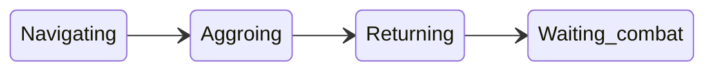

# Pull Configuration and Logic

This document explains how to configure and control the bot’s **pulling** behavior: how the bot finds mobs, navigates to them, gets aggro, and returns to camp. It is intended for human operators who need to set up the config file and use runtime commands.

## Overview

When pulling is enabled, the bot can automatically find mobs within range of camp, navigate to them (using MQ2Nav), aggro them using the configured pull method, and return to camp so the group can engage.

- **Master switch:** Pulling only runs when **`settings.dopull`** is `true`. Default is `false`.
- **Where to configure:** In your config file, set **`settings.dopull`** under the `settings` section, and all pull options under the **`pull`** section. See [Config file reference](#config-file-reference) below.

---

## Config file reference

### Settings

| Option     | Default | Purpose                                                                                 |
| ---------- | ------- | --------------------------------------------------------------------------------------- |
| **dopull** | `false` | Boolean. Enables or disables the pull loop. When `true`, the `pull` section is applied. |

### Pull section

All pull options live under **`config.pull`**. If a value is omitted, the default in the table below is used.

| Option                      | Default           | Purpose                                                                                                                                   |
| --------------------------- | ----------------- | ----------------------------------------------------------------------------------------------------------------------------------------- |
| **spell**                   | see below         | Single pull spell block: `{ gem, spell, range? }`. How to aggro. Omit or leave empty for melee.                                           |
| **radius**                  | 400               | Max horizontal distance from camp (X,Y) for pullable mobs.                                                                                |
| **zrange**                  | 150               | Max vertical (Z) difference from camp; mobs outside this are ignored.                                                                     |
| **pullMinCon**              | 2 (Green)         | Minimum consider (con) color index (1–7: Grey, Green, Light Blue, Blue, White, Yellow, Red) for a valid pull target. Used when **usePullLevels** is `false`. |
| **pullMaxCon**              | 5 (White)         | Maximum consider color index for a valid pull target.                                                                                     |
| **maxLevelDiff**            | 6                 | When using con colors: maximum level gap above the puller (e.g. “levels into red”). Mobs above `Me.Level() + maxLevelDiff` are rejected even if their con is in range. |
| **usePullLevels**           | `false`           | If `true`, use **pullMinLevel** / **pullMaxLevel** instead of con colors.                                                                  |
| **pullMinLevel** / **pullMaxLevel** | 1 / 125   | When **usePullLevels** is `true`, only mobs with level in this range are considered for pulling.                                           |
| **chainpullcnt**            | 0                 | Allow chain-pulling when current mob count is ≤ this value. See [When does the bot start a pull?](#when-does-the-bot-start-a-pull).       |
| **chainpullhp**             | 0                 | When the current engage target’s HP % is ≤ this (and chain conditions are met), the bot may start the next pull.                          |
| **mana**                    | 60                | Healer mana gate threshold. When **> 0** and at least one class is checked in **manaclass**, each in-group member whose class is checked must have mana **strictly above** this value before a pull. Set to **0** to disable the mana gate. |
| **manaclass**               | `{ 'CLR', 'DRU', 'SHM' }` | List of uppercase class short names (CLR, DRU, SHM) checked for **mana** before allowing a pull. Uncheck all classes (empty list) to disable the mana gate regardless of **mana**. |
| **leash**                   | 500               | While returning to camp with a mob, navigation is paused if the mob is farther than this distance (avoids over-chasing).                  |
| **addAbortRadius**          | 50                | While navigating to a pull target, NPCs within this radius (units) with line-of-sight can trigger an abort (return to camp).             |
| **usepriority**             | `false`           | If `true`, prefer mobs that match the runtime **Priority** list over path distance when choosing a pull target.                           |
| **hunter**                  | `false`           | Hunter mode: no makecamp; anchor is set once. The puller can be far from camp. See [Hunter mode vs camp mode](#hunter-mode-vs-camp-mode). |

**Note:** **pullarc** (directional pulling) is not in the config file; it is set at runtime with **`/cz xarc <degrees>`**. See [Runtime control](#runtime-control-commands).

#### Pull spell block (`pull.spell`)

The **`pull.spell`** table configures how the bot gets aggro. It has the same shape as other spell blocks (e.g. heal, debuff): **`gem`**, **`spell`**, and optional **`range`**.

- **gem** — How the pull is performed. Allowed values:
    - **`'melee'`** — Navigate in and attack (no cast). Default when `pull.spell` is omitted or empty.
    - **`'ranged'`** — Use a ranged weapon (bow). **`spell`** must be the **item name** of the bow. The bot will swap in that item to the range slot if needed, fire, then swap the previous item back. Requires **MQ2Exchange**; your cursor must be empty when the bot swaps the bow in or out.
    - **`1`–`12`** — Spell gem slot (cast the spell in that gem).
    - **`'item'`** — Cast from an item; **`spell`** = item name.
    - **`'alt'`** — Use an alternate ability; **`spell`** = AA name.
    - **`'disc'`** — Use a discipline; **`spell`** = disc name.
    - **`'ability'`** — Use a combat ability; **`spell`** = ability name. If **range** is omitted, the bot uses **10** (melee) as the pull range.
    - **`'script'`** — Run a script from **`config.script[spell]`**; **`spell`** = script key. Use **`spell = 'warp'`** for built-in warp pull (instant move to target and back).
- **spell** — Spell name, item name (for **gem** `'item'` or `'ranged'`), AA/disc/ability name, or script key. Ignored for **gem** `'melee'`.
- **range** — (Optional.) Distance at which the pull is used. If omitted, the bot derives it when possible from the spell or ability (e.g. spell gem → spell's MyRange − 5; **gem** `'ranged'` → item range; **gem** `'ability'` → 10).

**Bard:** When **`pull.spell`** has a numeric **gem** (1–12), the bot uses that same gem and spell for twist-on-pull (e.g. agro song). There are no separate engage_gem/engage_spell options.

#### Example pull configuration

```lua
pull = {
    spell = { gem = 'melee', spell = '', range = nil },  -- melee pull (default)
    radius = 400,
    zrange = 150,
    pullMinCon = 2,
    pullMaxCon = 5,
    maxLevelDiff = 6,
    usePullLevels = false,
    pullMinLevel = 1,
    pullMaxLevel = 125,
    chainpullcnt = 0,
    chainpullhp = 0,
    mana = 60,
    manaclass = { 'CLR', 'DRU', 'SHM' },
    leash = 500,
    addAbortRadius = 50,
    usepriority = false,
    hunter = false,
},
```

**`pull.spell`** examples:

- Melee (no cast): `spell = { gem = 'melee', spell = '' }`
- Spell in gem 3: `spell = { gem = 3, spell = 'Blast of Cold' }` — range derived from spell
- Ranged bow: `spell = { gem = 'ranged', spell = 'Short Bow of the Ykesha' }` — requires MQ2Exchange
- Discipline: `spell = { gem = 'disc', spell = 'Assault', range = 50 }` — optional explicit range
- Alt ability: `spell = { gem = 'alt', spell = 'Explosive Arrow' }`
- Combat ability: `spell = { gem = 'ability', spell = 'Kick', range = 10 }` — range defaults to 10 if omitted

Omit any **pull** option to use its default; you can set only **pull.spell** and **settings.dopull** for a minimal config.

---

## When does the bot start a pull?

The bot does **not** start a new pull while it is already in a pull (navigating, aggroing, returning, or waiting for combat). In that case it only runs the pull state machine until the current pull finishes.

When the bot is **not** already pulling, **StartPull()** is called when **any** of the following is true:

1. **Idle:** Mob count is 0 and there is no current engage target → start a pull.
2. **Chain (count):** Current mob count is **less than** `chainpullcnt` → start a pull (e.g. keep pulling until you have at least `chainpullcnt` mobs).
3. **Chain (HP):** Current mob count is ≤ `chainpullcnt` **and** the current engage target’s HP % is ≤ `chainpullhp` → start the next pull (e.g. pull the next mob when the current one is low).

In all cases, the internal **pre-conditions** must also pass (see [Pre-conditions that block pulling](#pre-conditions-that-block-pulling)). If they do not, no pull is started even when one of the three conditions above is true.

---

## Pull state flow

Once a pull has started, the bot moves through these phases:

1. **Navigating** — Paths to the chosen mob. May abort on timeout, low HP, or if the bot leaves camp (e.g. beyond radius + 40).
2. **Aggroing** — When in range, uses **pull.spell** (melee, ranged, spell gem, disc, ability, alt, item, or script) to get aggro.
3. **Returning** — Navigates back to camp with the mob. Leash logic may pause nav if the mob is too far.
4. **Waiting_combat** — Mob is in camp; normal melee/combat runs until the mob is dead or timers clear the pull state.



---

## Pre-conditions that block pulling

Even when one of the “start a pull” conditions is true, the bot will **not** start a pull if any of the following apply:

- **MasterPause** — Global pause is on; pull is skipped.
- **No MQ2Nav mesh** — No navigation mesh is loaded. Pull is skipped and **dopull** is turned off with an in-game message. Generate a mesh before using pulling.
- **Your HP ≤ 45%** — No new pull is started; an in-progress pull may also abort.
- **Group mana** — Disabled when **mana** is 0 or **manaclass** is empty. When enabled ( **mana** > 0 and at least one class checked), no new pull if any in-group member whose class is checked has mana **≤ mana** (must be strictly above **mana**). Unreadable mana is treated as 0. Checked classes not present in the group do not block.
- **Group corpse** — Any group member is dead (corpse); no new pull.
- **Return timer** — After pulling a mob, a short return timer blocks starting another pull until the previous pull’s mob is cleared (e.g. dead or out of range) or the timer expires.

---

## Hunter mode vs camp mode

- **Camp mode** (`hunter` false): MakeCamp is used; the puller returns to a fixed camp. If the puller is more than 200 distance from camp when the pull target is already engaged by someone else, the engage check can abort and the bot returns to camp.
- **Hunter mode** (`hunter` true): No makecamp; the anchor is set once (e.g. when you first enable pulling). The puller can be far from camp without triggering the 200-distance engage abort. Useful for a roaming puller.

---

## Runtime control (commands)

- **Toggle pulling:** `/cz dopull on` or `/cz dopull off`. You can also toggle without arguments (e.g. `/cz dopull`). Turning **off** clears target, stops nav/stick/attack; if **hunter** is true, it also clears the makecamp anchor.
- **Auto-disable:** Pull (`dopull`) is turned off automatically when you **die**, **zone**, or start **follow** (`/cz follow`, chat follow, or `/cz travel`).
- **Directional pulling:** `/cz xarc <degrees>` — Restrict pulls to an arc in front of the bot (e.g. `90` for a 90° cone). Use with no argument to turn directional pulling off.
- **Exclude / priority:** **ExcludeList** and **PriorityList** are **runtime** (runconfig), not in the pull config file. Use **`/cz exclude <name>`** to add a mob to the exclude list (pull target selection will skip it) and **`/cz exclude remove [name]`** to remove one; use **`/cz priority <name>`** to add and **`/cz priority remove [name]`** to remove. When **pull.usepriority** is `true`, the bot prefers priority mobs over path distance. You can target a mob and use `/cz exclude` or `/cz priority` (or their remove forms) without a name to use the target’s name. The GUI **Mob lists** tab also lets you view and edit both lists for the current zone. All changes are saved automatically to **cz_common.lua** in the per-zone block **zones**[*zone*] (excludelist, prioritylist, charmlist, nuke flavors, immune).

---

## Relation to Group.Puller

- **No gating:** The bot does **not** check whether this character is the **Group.Puller**. Any character with **dopull** `true` will run the pull loop. You can have multiple pullers or a single designated puller; the config does not restrict who pulls.
- **MT target preference:** When this bot is the **Main Tank** (and TankName is set to `"automatic"`), the bot uses **Group.Puller** only to **prefer the Puller’s current target** when choosing which mob from the camp list to engage. So: the puller brings a mob to camp → the MT picks a target and prefers that mob. For how to set up MT, MA, and Puller, see [Tank and Assist Roles](tank-and-assist-roles.md).

---

## FTE / already engaged

If the bot sees that the pull target is already engaged by someone else (another player or pet), it abandons the pull and returns to camp. That target may be temporarily excluded from pull selection (FTE list) so the bot does not immediately try to pull it again.

---

## Pull target selection

The bot builds a list of candidate mobs that:

- Are NPCs.
- Are within **radius** (2D) and **zrange** (Z) of camp.
- Pass the level/con filter: if **usePullLevels** is `true`, mob level must be between **pullMinLevel** and **pullMaxLevel**; otherwise the mob’s consider (con) color must be between **pullMinCon** and **pullMaxCon**, and the mob’s level must be at most **Me.Level() + maxLevelDiff** (so “levels into red” is capped).
- Have a valid navigation path (MQ2Nav).
- Are not in the runtime **ExcludeList**.
- Are not on the FTE (first-to-engage) list.
- If **pullarc** is set, lie within the chosen arc in front of the bot.

From that list, the bot picks one target:

- If **usepriority** is `true` and **PriorityList** is set, it prefers the first mob whose name matches the priority list.
- Otherwise it chooses the **closest by path length** (shortest nav path to camp).
