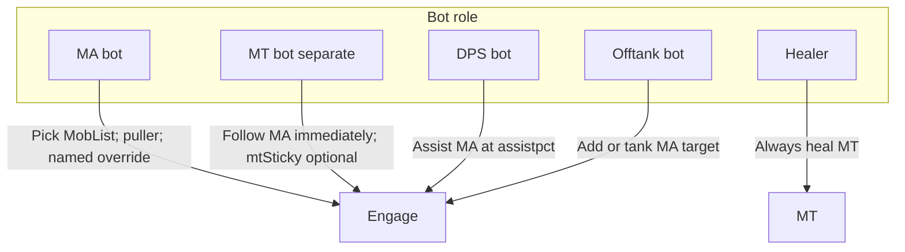
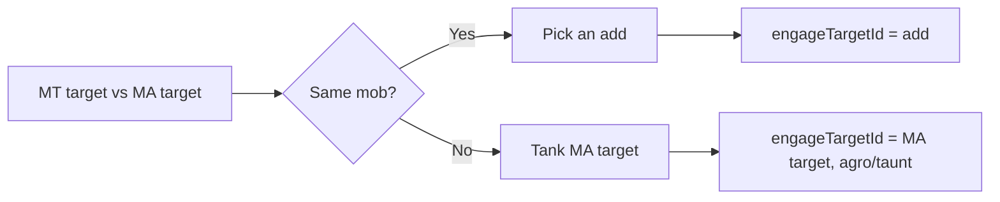

# Tank and Assist Roles

This document explains how to configure **Main Tank (MT)**, **Main Assist (MA)**, and **Puller**, and how each bot behaves in different scenarios.

## Overview

- **Main Tank (MT)**  
  The character who receives **heals** (healers prioritize this person). MT bots **never pick** camp mobs. When MA and MT are different bots, the MT follows the MA's target immediately (ignores assist-at %). **`mtSticky`** makes a separate MT bot keep its current target once engaged; it is **ignored** when the same bot is both MA and MT.

- **Main Assist (MA)**  
  The character who **selects targets** from the mob list and whose target DPS/offtank follow. The MA bot picks from MobList (named first, puller priority, sticky mid-fight with named override). **`/cz attack`** engages the MA's target **immediately** and keeps that engagement until the target dies or you run `/cz abort`, turn off domelee, or issue another `/cz attack`.

- **Puller**  
  Set in the game (group window). When this bot is the **MA**, it prefers the **Puller's target** when choosing which mob to engage from the camp list (e.g. the mob the puller is bringing in).

Heals always go to the MT. DPS follows the MA at **assist-at %**. Separate MT follows the MA **immediately**. When MT and MA are different, offtank logic depends on whether they are on the same mob or not (see Offtank below).

If **AssistName** is unset, it falls back to **TankName** — the MT bot becomes the effective MA and runs MA picker logic.

---

## How to Configure

### TankName (Main Tank)

- **Where:** Config file under `settings.TankName`, or at runtime with `/cz tank <name>` or `/cz tank automatic`.
- **Values:**
  - **Character name** — Healers focus on this character. If this bot is also the effective MA (AssistName unset or same name), it selects camp targets.
  - **`"manual"`** — No default MT; set at runtime with `/cz tank SomeName`.
  - **`"automatic"`** — Resolve from the EQ group Main Tank role (not in raid), then **`mt_list`** fallback. In raid, **`mt_list` only**. See [Automatic MA/MT Selection](automatic-ma-mt-selection.md).

Healers always use the resolved MT. MT bots do **not** pick mobs unless they are also the effective MA.

### AssistName (Main Assist)

- **Where:** Config file under `settings.AssistName`, or at runtime with `/cz assist <name>` or `/cz assist automatic`.
- **Values:**
  - **Character name** — DPS/offtank/separate MT follow this character's target. MA bot selects from MobList.
  - **`"manual"`** — No default MA; set at runtime with `/cz assist SomeName`.
  - **`"automatic"`** — Resolve from raid/group Main Assist, then **`ma_list`** fallback. See [Automatic MA/MT Selection](automatic-ma-mt-selection.md).

If **AssistName** is unset, it defaults to **TankName** (legacy "everyone assists the tank").

### Puller

- **Where:** Game group window (right-click → Puller).
- **Effect:** When this bot is the **MA**, initial mob pick prefers the Puller's current target.

### mtSticky (melee config)

Applies only when **MT and MA are different bots**:

- **No current target** — follow MA immediately.
- **Has target, sticky off** — switch to MA's new target immediately.
- **Has target, sticky on** — keep current target until it dies; never switch for MA retargets or named spawns.

Ignored when the same bot is both MA and MT.

---

## Who Does What (Mermaid)

- **MA bot:** Picks mob from MobList. Sticks mid-fight except non-named → named in camp.
- **Separate MT bot:** Follows MA immediately; **`mtSticky`** locks target once engaged.
- **DPS bot:** Syncs to MA at **assistpct**.
- **Offtank bot:** See Offtank diagram below.
- **Healer:** Always MT.

---

## Offtank Decision (Mermaid)

---

## Scenarios

### Legacy: everyone assists the tank

- Set **TankName** only; leave **AssistName** unset.
- That bot is effective MA + MT: runs **selectMATarget**; **`mtSticky` ignored**.

### Human MA, bot MT

- **AssistName** = human; **TankName** = MT bot.
- MT bot follows human MA immediately (or sticks with **mtSticky**).

### Bot MA, bot MT (different)

- **AssistName** = MA bot; **TankName** = MT bot.
- MA bot picks targets; MT bot follows (with optional **mtSticky**).

### Automatic mode

Set **`TankName`** and/or **`AssistName`** to **`"automatic"`** (the default for `TankName`). CZBot reads EQ group/raid roles and falls back to ordered lists in **`cz_common.lua`**. Full resolution order, availability rules, list editing, and **`maAnchorLeash`** are documented in [Automatic MA/MT Selection](automatic-ma-mt-selection.md).

---

## MA-anchored mob bubble

When **`settings.maCampAnchor`** is on, non-MA bots center MobList on the resolved MA within **`maAnchorLeash`**. Combat inject adds the MA's (then MT fallback) ATTACK target into MobList. Configure anchor and leash on the **Roles** tab (`/czshow` → Roles). See [Automatic MA/MT Selection — maAnchorLeash](automatic-ma-mt-selection.md#maanchorleash).

---

## See also

- [Automatic MA/MT Selection](automatic-ma-mt-selection.md) — `ma_list`, `mt_list`, automatic resolution, multi-box sync
- [Tanking configuration](tanking-configuration.md) — stick, assistpct, camp leash
- [Offtank configuration](offtank-configuration.md) — offtank setup
- [Healing configuration](healing-configuration.md) — heal tank phase
